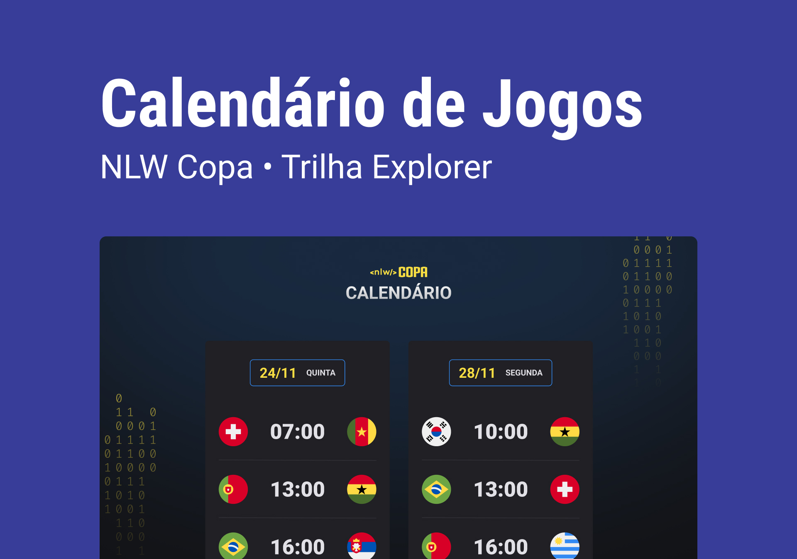

NLW #10 Copa 

> Trilha Explorer

Evento exclusivo e gratuito, promovido pela Rocketseat para ensino de tecnologias WEB.

[🔗Clique aqui para acessar]https://github.com/Alexandre0904/NLW-10-Copa

## 🛠️ Tecnologias

- HTML e CSS
- JavaScript
- Git e Github

## Projeto
o calendário da copa de 2022.

## Layout

Você pode visualizar o layout do projeto através [DESSE LINK](https://www.figma.com/fileJ1Z33MISC22YZ88wfxiIns/NLW-Copa-Explorer/duplicate). É necessário ter conta no [Figma](https://figma.com) para acessá-lo.

##  ❤️ Contato

alexandreaugustosan93@gmail.com